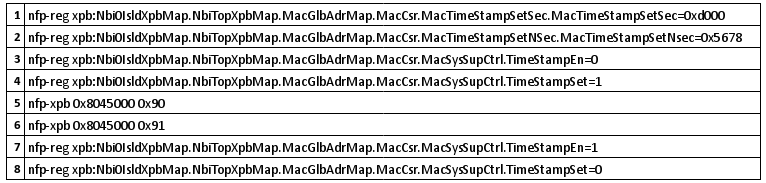

# TimeStamp-for-Netronome-Card
set timestamp

 Comando 1 : tem a função de alterar os valores em segundos do tempo;
 
 Comando 2 : realiza a alteração dos valores em nanossegundos;
 
 Comando 3 : desativa otempo da placa;
 
 Comando 4 : habilita a opção de incluir informações de tempo;
 
 Comando 5 : para o contador do tempo;
 
 Comando 6 : iniciará o incrementador de tempo com o valor novo que foi alterado;
 
 Comando 7 : habilita o tempo da placa novamente;
 
 Comando 8 : desativa a opção de alterar o tempo da placa da Netronome.
 
